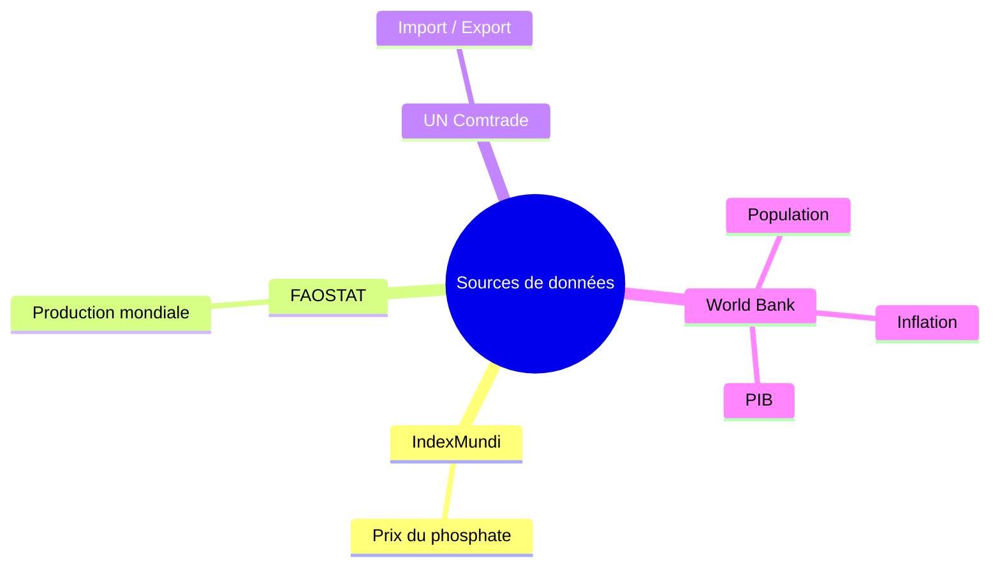
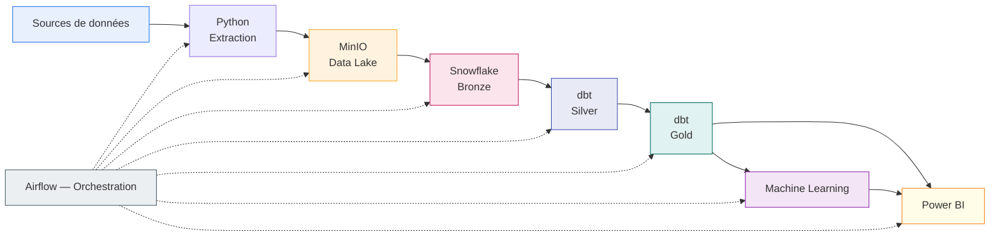
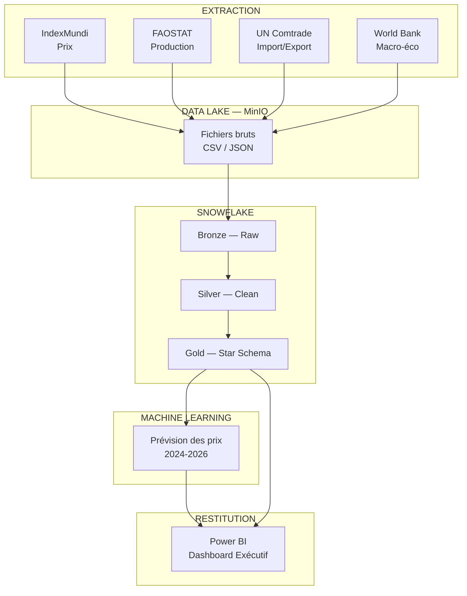
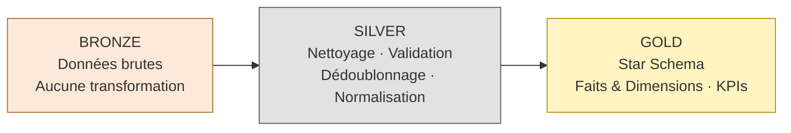
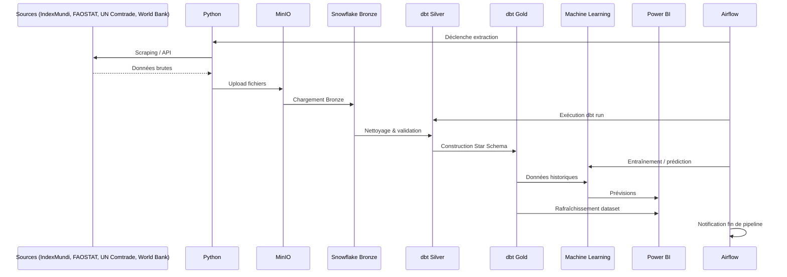
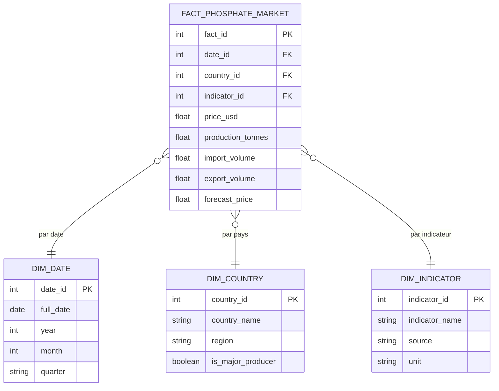
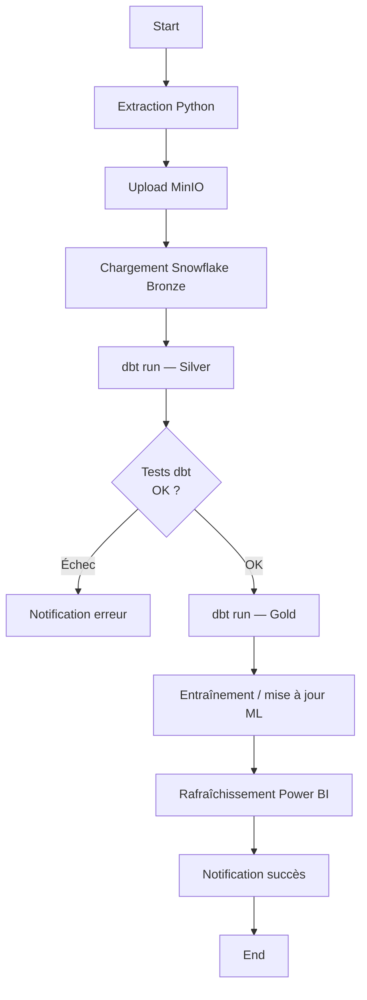
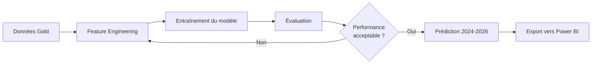
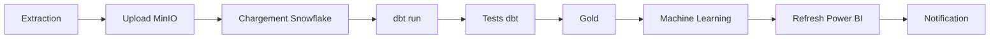
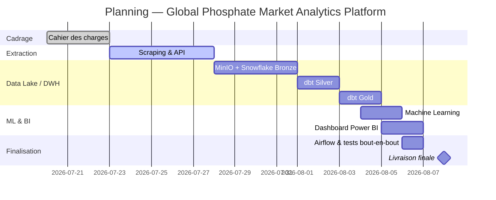

<div align="center">

#  GLOBAL PHOSPHATE MARKET ANALYTICS PLATFORM

### Cahier des Charges — Data Engineering & Data Analytics

**Plateforme d'analyse et de prédiction du marché mondial du phosphate**

---

 Juillet 2026 ·  Projet Fil Rouge ·  Deadline : 08/08/2026

*Data Collection · Data Lake · Data Warehouse · Machine Learning · Business Intelligence*

---

</div>

<div align="center">

| | | | |
|:---:|:---:|:---:|:---:|
|  **Python** |  **Snowflake** |  **dbt** |  **Power BI** |
|  **Airflow** |  **MinIO** | **Docker** |  **Scikit-Learn** |

</div>

\pagebreak

##  Sommaire

| # | Section | 
|---|---------|
| 1 | [Page de couverture](#-global-phosphate-market-analytics-platform) |
| 2 | [Présentation du projet](#2-présentation-du-projet) |
| 3 | [Contexte métier](#3-contexte-métier) |
| 4 | [Objectifs](#4-objectifs) |
| 5 | [Périmètre du projet](#5-périmètre-du-projet) |
| 6 | [Architecture globale](#6-architecture-globale) |
| 7 | [Architecture technique détaillée](#7-architecture-technique-détaillée) |
| 8 | [Architecture Medallion](#8-architecture-medallion) |
| 9 | [Technologies utilisées](#9-technologies-utilisées) |
| 10 | [Flux de données](#10-flux-de-données) |
| 11 | [Description des couches](#11-description-de-chaque-couche) |
| 12 | [Modèle dimensionnel](#12-modèle-dimensionnel) |
| 13 | [Pipeline complet](#13-pipeline-complet) |
| 14 | [Machine Learning](#14-machine-learning) |
| 15 | [Dashboard Power BI](#15-dashboard-power-bi) |
| 16 | [Orchestration Airflow](#16-orchestration-airflow) |
| 17 | [Structure des dossiers](#17-structure-des-dossiers) |
| 18 | [Planning du projet](#18-planning-du-projet) |
| 19 | [Analyse des risques](#19-analyse-des-risques) |
| 20 | [Critères de réussite](#20-critères-de-réussite) |
| 21 | [Livrables](#21-livrables) |
| 22 | [Évolutions futures](#22-évolutions-futures) |
| 23 | [Conclusion](#23-conclusion) |

\pagebreak

## 2. Présentation du projet

>  **En une phrase** : Une plateforme end-to-end qui collecte, structure et prédit les dynamiques du marché mondial du phosphate pour éclairer la décision stratégique.

| Élément | Détail |
|---|---|
|  **Nom du projet** | Global Phosphate Market Analytics Platform |
|  **Type** | Projet Fil Rouge — Data Engineering / Data Analytics |
|  **Domaine** | Marché des matières premières — Phosphate |
|  **Nature** | Pipeline ELT + Data Warehouse + ML + BI |
|  **Échéance** | 08/08/2026 |

---

## 3. Contexte métier

Le phosphate est une ressource stratégique pour l'agriculture mondiale (engrais), sous tension géopolitique et économique croissante. Les décideurs (industriels, investisseurs, institutions) manquent d'un outil unifié croisant **prix, production, échanges commerciaux et indicateurs macroéconomiques**.

>  **Callout — Enjeu métier**
> Sans consolidation de ces données dispersées, l'analyse du marché reste fragmentée, réactive, et peu prédictive.

### Sources de données mobilisées



---

## 4. Objectifs

|  Objectif | Description |
|---|---|
| **O1 — Centraliser** | Unifier 4 sources hétérogènes dans un Data Lake puis un Data Warehouse |
| **O2 — Fiabiliser** | Garantir qualité, cohérence et traçabilité des données (tests dbt) |
| **O3 — Prédire** | Anticiper l'évolution des prix du phosphate (2024–2026) via Machine Learning |
| **O4 — Visualiser** | Fournir un dashboard exécutif interactif et décisionnel |
| **O5 — Automatiser** | Orchestrer l'ensemble du pipeline sans intervention manuelle (Airflow) |

---

## 5. Périmètre du projet

 **Inclus dans le projet**
- Extraction automatisée (scraping + API) des 4 sources
- Data Lake MinIO + Data Warehouse Snowflake (Bronze/Silver/Gold)
- Transformations dbt avec tests de qualité
- Modèle de prévision des prix (ML)
- Dashboard Power BI exécutif
- Orchestration Airflow bout en bout

 **Hors périmètre**
- Développement d'une application web front-end dédiée
- Trading algorithmique en temps réel
- Couverture de matières premières autres que le phosphate

---

## 6. Architecture globale



---

## 7. Architecture technique détaillée



### Détail des couches techniques

| Couche | Rôle | Outils |
|---|---|---|
| **Extraction** | Scraping & appels API | Python, Requests, BeautifulSoup, Selenium |
| **Stockage brut** | Data Lake objet | MinIO |
| **Entrepôt** | Bronze / Silver / Gold | Snowflake, dbt Core |
| **Prédiction** | Modélisation prix | Scikit-Learn |
| **Restitution** | Dashboards | Power BI |
| **Orchestration** | Automatisation | Apache Airflow, Docker |
| **Versioning** | Code & collaboration | Git, GitHub, VS Code |

---

## 8. Architecture Medallion



| Couche | Contenu | Traitements |
|---|---|---|
|  **Bronze** | Copie fidèle des sources | Aucun — traçabilité brute |
|  **Silver** | Données propres | Suppression doublons, gestion des valeurs manquantes, normalisation, tests dbt |
|  **Gold** | Modèle analytique | Star Schema, tables de faits, dimensions, KPIs métier |

---

## 9. Technologies utilisées

<div align="center">

| Catégorie | Technologies |
|---|---|
|  **Langage & Extraction** | Python · Pandas · Requests · BeautifulSoup · Selenium |
|  **Stockage** | MinIO |
|  **Entrepôt de données** | Snowflake |
|  **Transformation** | dbt Core |
|  **Conteneurisation** | Docker |
|  **Orchestration** | Apache Airflow |
|  **Machine Learning** | Scikit-Learn |
|  **Visualisation** | Power BI |
|  **Versioning** | Git · GitHub · VS Code |

</div>

---

## 10. Flux de données



---

## 11. Description de chaque couche

>  **Bronze** — Ingestion brute depuis MinIO vers Snowflake, sans altération, pour garantir la traçabilité complète des données sources.

>  **Silver** — Application des règles de qualité : suppression des doublons, traitement des valeurs manquantes, normalisation des formats (dates, unités, devises), exécution des tests dbt (`not_null`, `unique`, `relationships`).

>  **Gold** — Construction du modèle dimensionnel orienté analyse : tables de faits (prix, production, échanges) reliées aux dimensions (temps, pays, produit).

---

## 12. Modèle dimensionnel



---

## 13. Pipeline complet



---

## 14. Machine Learning

| Élément | Détail |
|---|---|
|  **Objectif** | Prévision des prix du phosphate |
|  **Horizon** | 2024 · 2025 · 2026 |
|  **Approche** | Régression / séries temporelles (Scikit-Learn) |
|  **Données d'entrée** | Table de faits Gold (historique prix, production, macro-économie) |
|  **Sortie** | Prix prédit injecté dans le dashboard Power BI |



---

## 15. Dashboard Power BI

>  **Dashboard Exécutif** — vue synthétique et décisionnelle du marché mondial du phosphate.

| Page | Contenu |
|---|---|
|  **Vue d'ensemble** | KPIs clés, tendance globale |
|  **Prix** | Évolution historique et prévisionnelle |
|  **Production** | Analyse par pays et par période |
|  **Import** | Volumes et tendances par pays |
|  **Export** | Volumes et tendances par pays |
|  **Comparaison pays** | Benchmark des principaux producteurs |
|  **Prévisions** | Résultats du modèle ML |
|  **Insights** | Synthèse des enseignements clés |

---

## 16. Orchestration Airflow



| Tâche Airflow | Fréquence |
|---|---|
| Extraction & ingestion | Quotidienne / hebdomadaire selon la source |
| Transformation dbt | À chaque nouvelle donnée |
| Entraînement ML | Mensuelle |
| Refresh Power BI | À chaque fin de pipeline |
| Notifications | Succès / échec de chaque run |

---

## 17. Structure des dossiers

```
 global-phosphate-analytics/
├──  extraction/
│   ├── indexmundi_scraper.py
│   ├── faostat_extractor.py
│   ├── comtrade_extractor.py
│   └── worldbank_extractor.py
├──  dbt_project/
│   ├── models/
│   │   ├── bronze/
│   │   ├── silver/
│   │   └── gold/
│   └── tests/
├──  ml/
│   ├── train_model.py
│   └── predict.py
├──  airflow/
│   └── dags/
│       └── phosphate_pipeline_dag.py
├──  powerbi/
│   └── dashboard.pbix
├──  docker/
│   └── docker-compose.yml
└──  README.md
```

---

## 18. Planning du projet



---

## 19. Analyse des risques

|  Risque | Impact | Probabilité | Mitigation |
|---|---|---|---|
| Données 2026 incomplètes chez les sources | Moyen | Élevée | Recours au forecast ML au-delà des données réelles disponibles |
| Instabilité des sites scrapés | Moyen | Moyenne | Scripts robustes + gestion d'erreurs + Selenium en secours |
| Délai serré (deadline 08/08/2026) | Élevé | Moyenne | Planning strict, priorisation des livrables critiques |
| Qualité hétérogène entre sources | Moyen | Élevée | Tests dbt systématiques en couche Silver |
| Complexité de l'orchestration Airflow | Faible | Moyenne | Tests progressifs par tâche avant intégration complète |

---

## 20. Critères de réussite

 Pipeline end-to-end fonctionnel de l'extraction jusqu'au dashboard
 Données Bronze/Silver/Gold cohérentes et testées
 Modèle ML produisant des prévisions exploitables (2024–2026)
 Dashboard Power BI clair, interactif et orienté décision
 Orchestration Airflow autonome et fiable
 Documentation complète et professionnelle du projet

---

## 21. Livrables

| Livrable | Format |
|---|---|
| Scripts d'extraction | Python (.py) |
| Data Lake | MinIO (buckets) |
| Data Warehouse | Snowflake (Bronze/Silver/Gold) |
| Projet dbt | Modèles + tests |
| Modèle ML | Script + artefact de prédiction |
| Dashboard | Power BI (.pbix) |
| Orchestration | DAG Airflow |
| Documentation | Cahier des charges (ce document) + README |

---

## 22. Évolutions futures

-  Ajout de nouvelles matières premières (potasse, azote)
-  API publique d'exposition des données consolidées
-  Modèles ML avancés (deep learning, séries temporelles multivariées)
-  Migration complète vers une orchestration cloud managée

---

## 23. Conclusion

>  **Global Phosphate Market Analytics Platform** structure une chaîne de valeur data complète — de la donnée brute dispersée à l'insight décisionnel — au service d'une meilleure compréhension du marché mondial du phosphate.

<div align="center">

---
*Document réalisé dans le cadre du projet Fil Rouge — Data Engineering & Data Analytics*

</div>